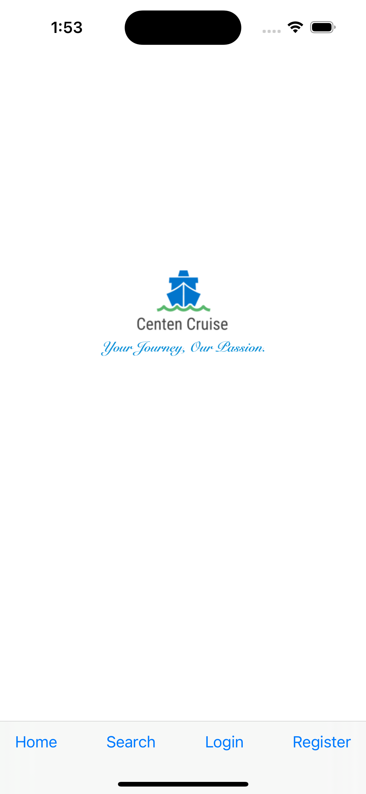
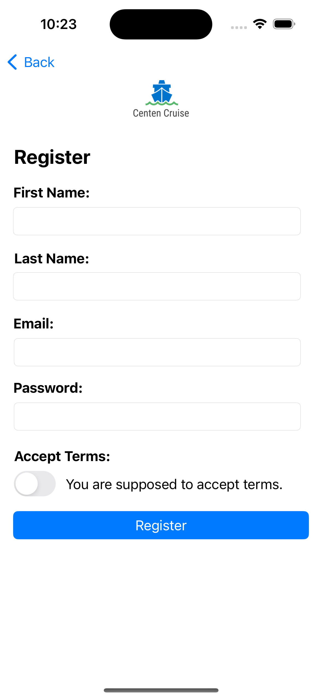
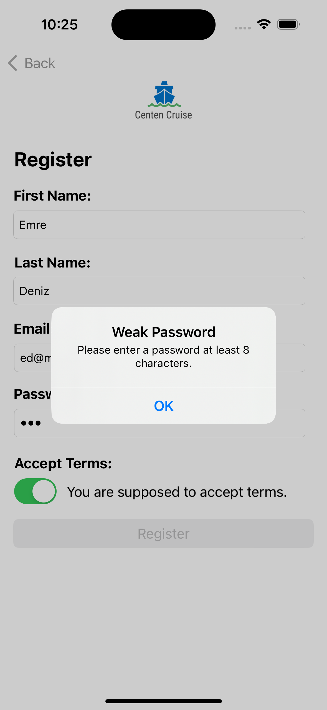
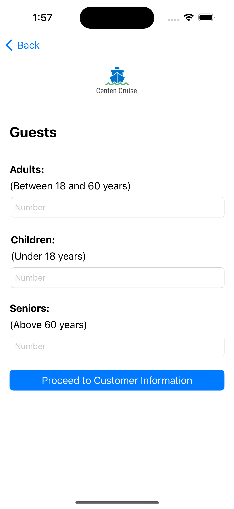
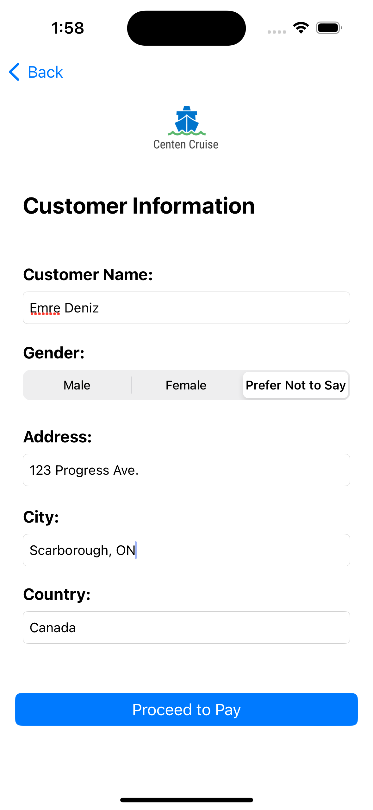
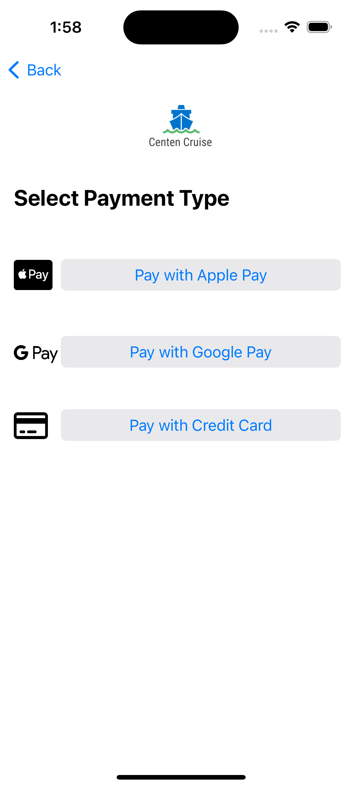
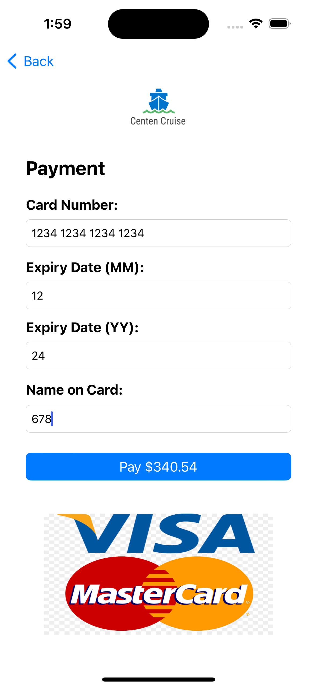
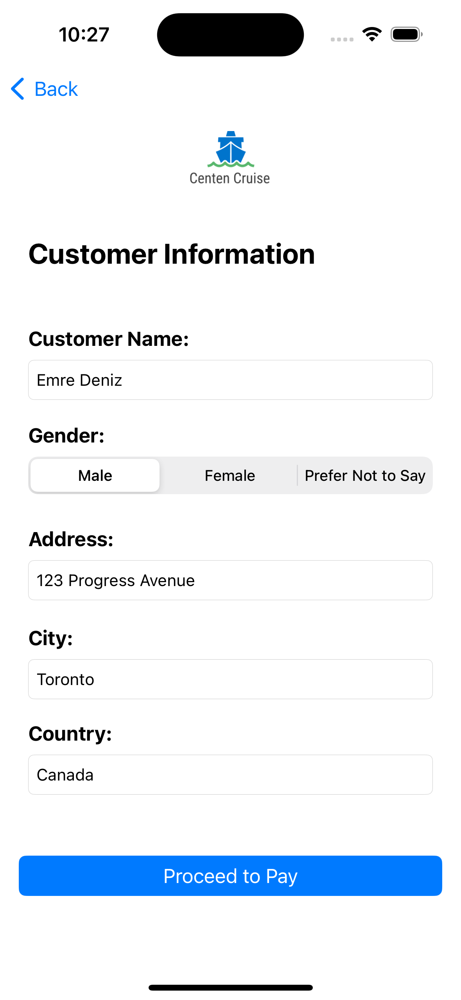
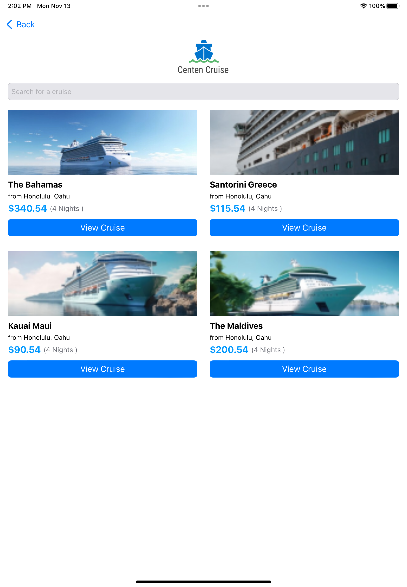
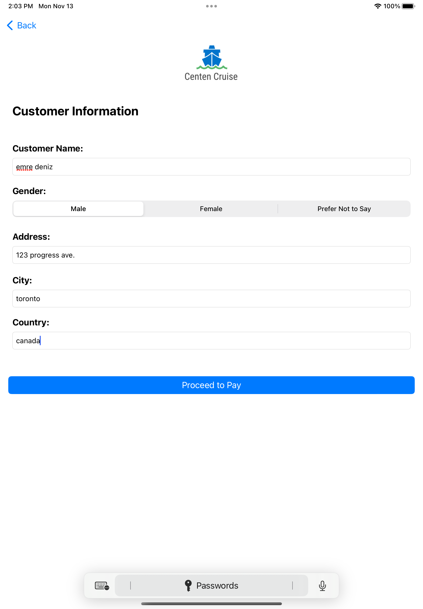

# Cruise-Booking-App-iOS
Cruise booking application developed in iOS native using Swift and SQLite

### HOW TO RUN:
```console
Open project in Xcode
Run on Simulator
```

### FEATURES:
1. User registration
2. User rogin
3. Home screen to list cruises
4. Search screen
5. Cruise details screen
6. Book a cruise
7. Enter guests information
8. Enter customer personal information
9. Select payment type
10. Payment with credit card
11. Confirmation screen
12. **iPhone and iPad compatible UI** for both portrait and landscape view

### SCREENSHOTS:
#### iPhone
<kbd></kbd>    <kbd></kbd>    <kbd></kbd>

<kbd></kbd>    <kbd></kbd>    <kbd></kbd>

<kbd></kbd>    <kbd></kbd>

#### iPad
<kbd></kbd>    <kbd></kbd>

<kbd></kbd>
