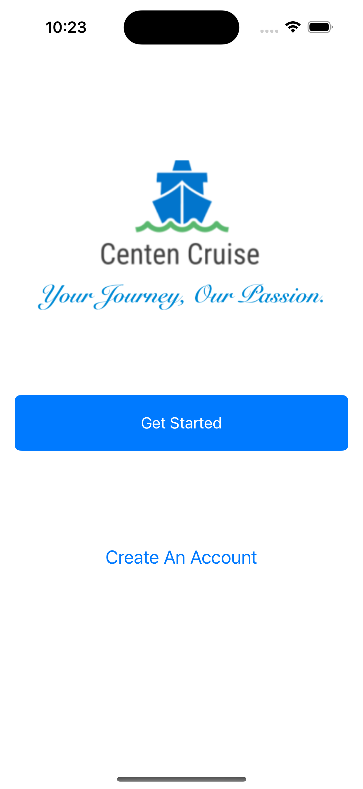
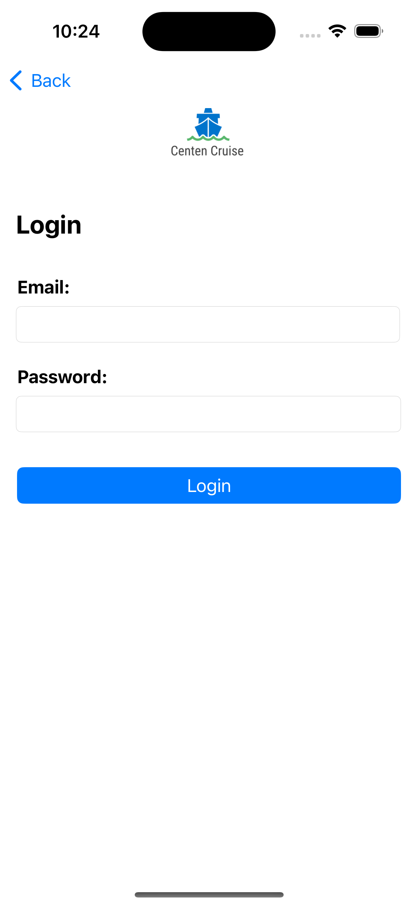
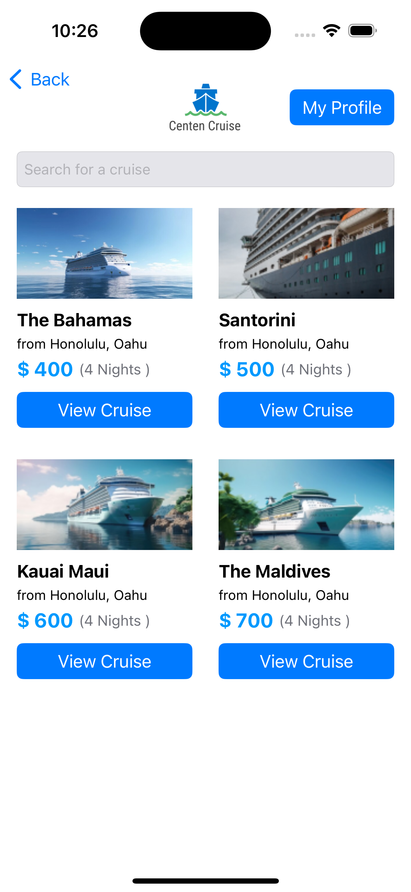
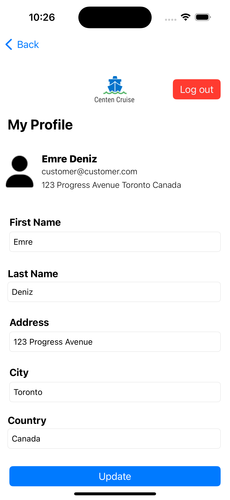
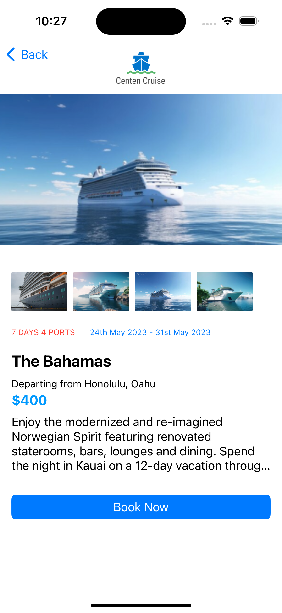
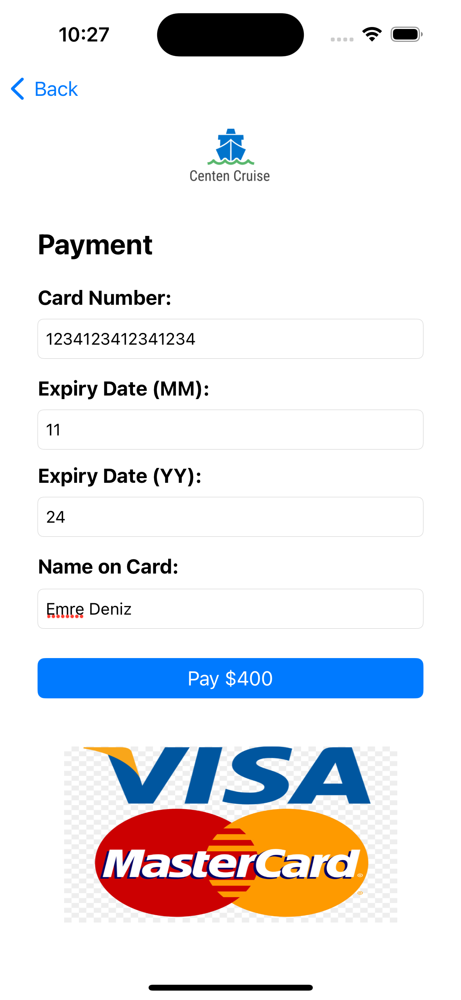
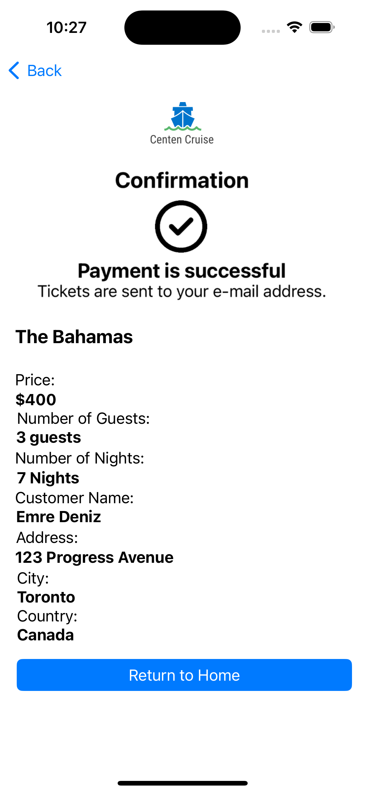
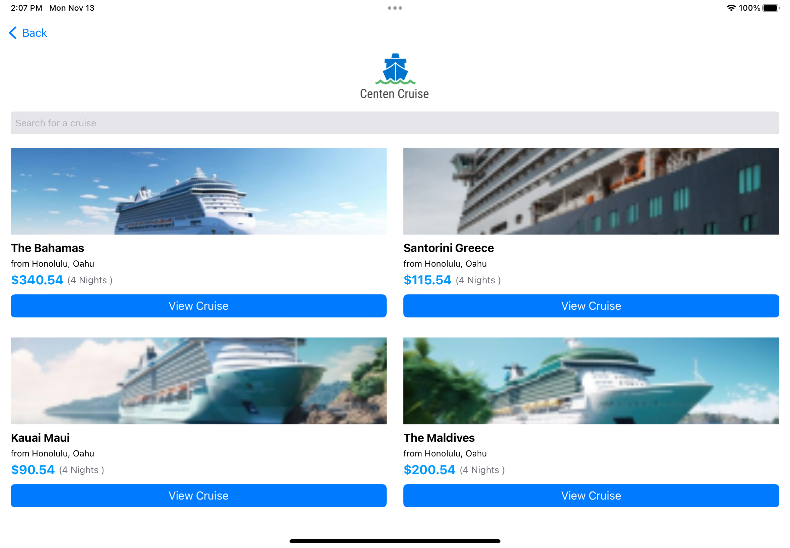

# Cruise-Booking-App-iOS
Cruise booking application developed in iOS native using Swift and SQLite3

### HOW TO RUN:
```console
Open project in your Xcode
Run on iPhone or iPad Simulator
```

### FEATURES:
1. User registration
2. User login
3. Profile screen
4. Home screen to list all cruises
5. Cruise details screen
6. Book a cruise
7. Enter guests information
8. Enter customer personal information
9. Select payment type (Apple Pay, Google Pay, Credit Card)
10. Payment with credit card
11. Confirmation screen
12. **iPhone and iPad compatible UI** for both portrait and landscape views

### SCREENSHOTS:
#### iPhone
<kbd></kbd>    <kbd></kbd>    <kbd></kbd>

<kbd></kbd>    <kbd></kbd>    <kbd></kbd>

<kbd></kbd>    <kbd></kbd>    <kbd></kbd>

<kbd></kbd>    <kbd></kbd>
#### iPad
<kbd></kbd>    <kbd></kbd>

<kbd></kbd>
